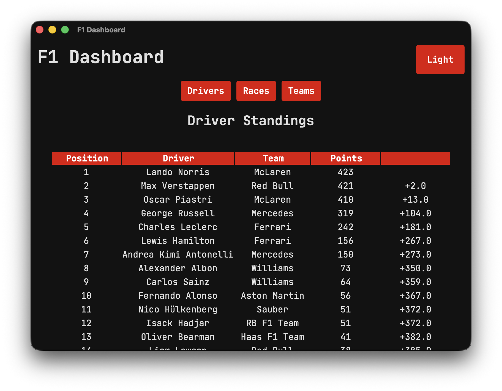
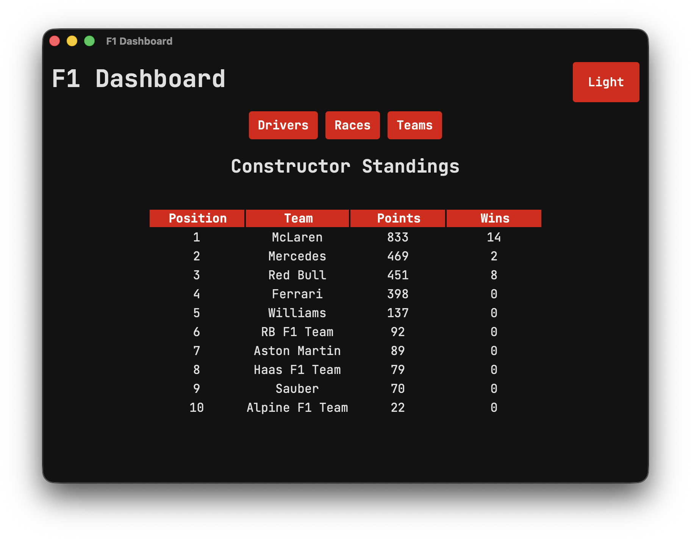

# F1 Dashboard

## Description

F1 Dashboard displays the current Formula 1 driver standings, race schedule and constructors standings.  
Data is fetched from the [Ergast API](https://api.jolpi.ca/ergast/).

## Features

- View current driver standings
- Check upcoming and past race schedules

## Preview

 


## Getting Started

### Prerequisites

- Node.js installed
- npm installed

### Running the App

```bash
cd dash-backend
npm run tauri dev
```

### Building the App

```bash
cd dash-backend
npm run tauri build
```
